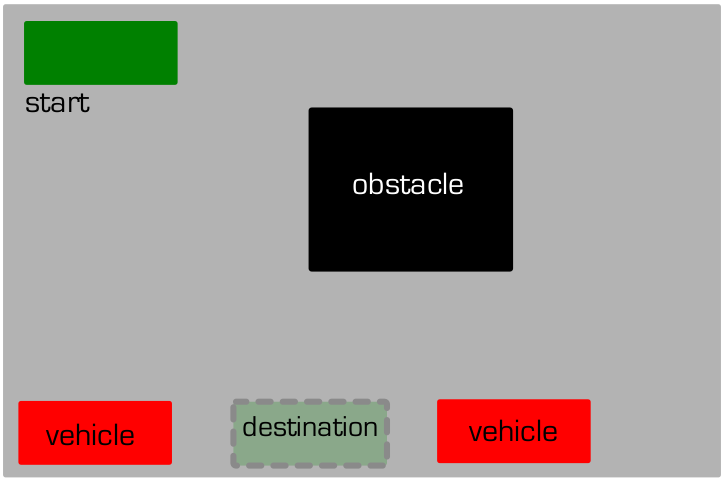
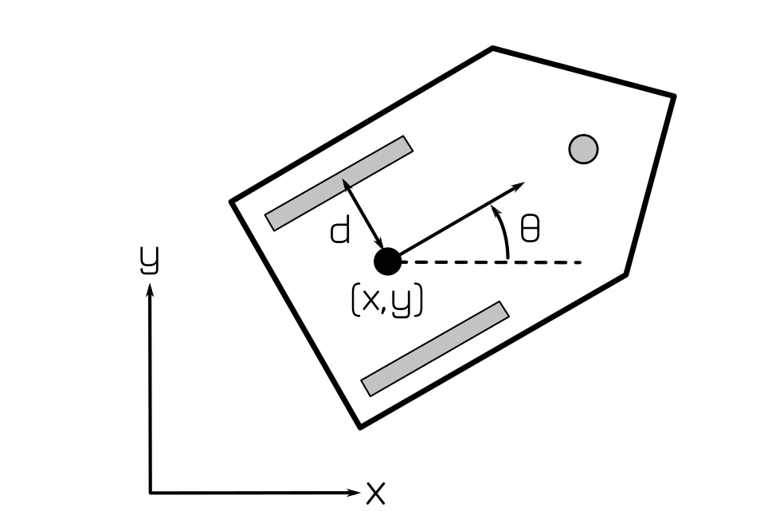
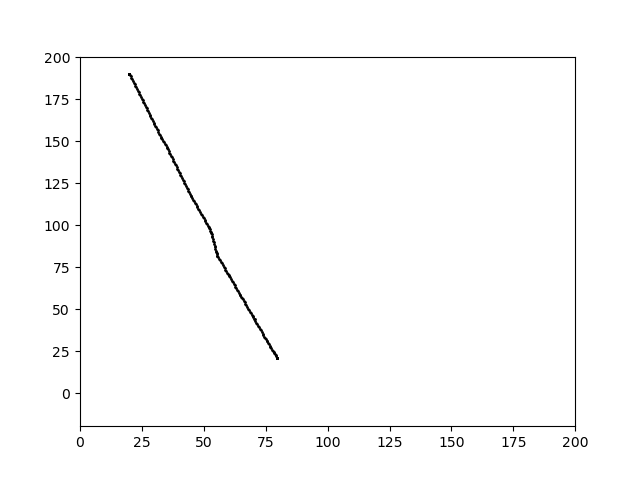
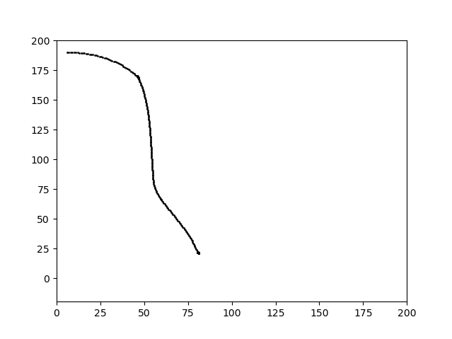
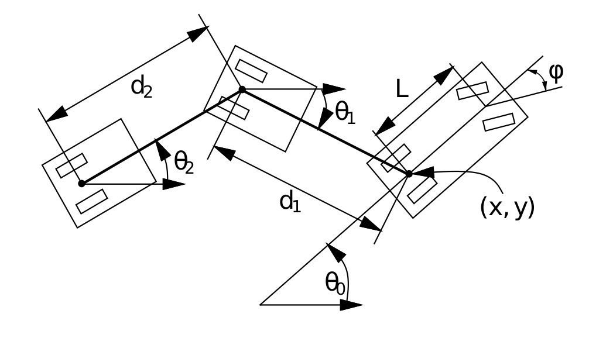
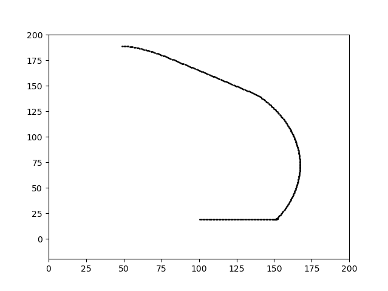

# Motion_Planning_for_Valet_Parking

## The Parking Problem
A common path planning problem for autonomous vehicles involves maneuvering in tight spaces and cluttered environments, particularly while parking. To address these issues, non-holonomic constraints of the vehicles must be taken into consideration. At the same time, collision checking algorithm must also be deployed to make sure the vehicle path is collision-free. Considering the above constraints, this project implements path planning for the following types of vehicles:
* A DiWheel Robot
* A car with Akerman Steering
* A car pulling Trailer

## About the environment
The project is implemented using the pygame library of python. The environment for the same is a parking lot in a two dimensional grid world. In each instance, a car starts at the Northwest corner of the bounded two dimensional field. The car is to be parked in a compact space in the southern border, flanked by vehicles both in front of and behind the target space. Additionally, there is an island in the central region. The environment approximately looks like the following:

## DiWheel Kinematics
  A Diwheel robot is a robot having two parallel wheel side by side. Robots having diwheel kinematics have the capability of taking spot turns, unlike autonomous cars. A figure showing diwheel kinematics is displayed below:

Here is the animation of delivery robot:

Here is the graph plot of the final path for the diwheel kinematics:

## Akerman Steering

Akerman Steering mechanism is used to some extent in today's cars. The following figure depicts akerman steering:

Here is the animation of car:

Here is the graph plot of final path for Akerman Steering

## A Car pulling Trailer

A Car pulling trailer has a car that works on Akerman steering. This car has a trailer attached at the back of the car. The following figure depicts a car pulling trailer:

Here is the animation of car:

Here is the graph plot of final path for the truck pulling trailer:

The graphs for the above simulations are not as smooth as they should be because of the fact that the entire world is a 2 dimensional grid world. This results in round off errors.

